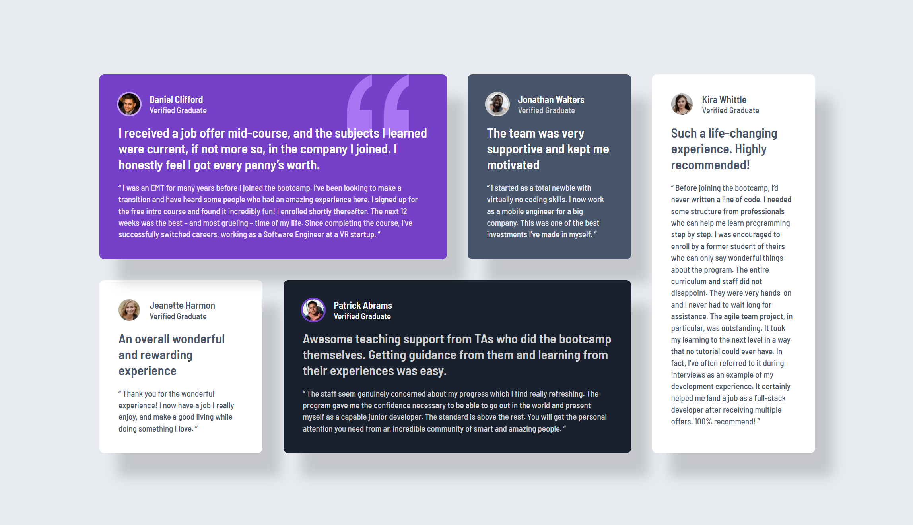

# 🌐 Frontend Mentor - Testimonials grid section solution

This is my solution for the [Testimonials grid section challenge on Frontend Mentor](https://www.frontendmentor.io/challenges/testimonials-grid-section-Nnw6J7Un7). Frontend Mentor challenges help you improve your coding skills by building realistic projects.

---

## 📋 Table of contents

- [Overview](#-overview)
  - [Features](#-features)
  - [Preview](#-preview)
  - [Links](#-links)
- [My process](#-my-process)
  - [Built with](#-built-with)
  - [What I learned](#-what-i-learned)
- [Development Workflow](#-development-workflow)
- [Useful Resources](#-useful-resources)
- [Author](#-author)
- [Acknowledgments](#-acknowledgments)

---

## 🌍 Overview

### ✨ Features

A responsive testimonial grid section built with semantic HTML and modern CSS.
The layout adapts smoothly across screen sizes using CSS Grid and custom properties, with an emphasis on clean structure, reusability, and accessibility.

### 🖼️ Preview



### 🔗 Links

- 💡 Solution URL: [Frontend Mentor Submission](https://www.frontendmentor.io/solutions/four-card-feature-section-with-css-and-tailwindcss-DoEtEmeepy)
- 🌐 Live Site URL: [Live Demo](https://thewizard04-testimonial-grid.vercel.app)

---

## 🛠️ My process

### 🧰 Built with

| Category  | Tools                     |
| --------- | ------------------------- |
| Structure | **Semantic HTML5 markup** |
| Styles    | **CSS**                   |

### 🧠 What I learned

- Improved my understanding of semantic HTML5 markup
- Strengthened my styling skills using CSS

Here are the snippets which shows the grid layout for different screen sizes:

```css
main {
  grid-template-columns: 1fr;
}

@media (min-width: 48rem) {
  main {
    grid-template-columns: repeat(2, 1fr);
  }
}

@media (min-width: 64rem) {
  main {
    max-width: 1200px;
    grid-template-columns: repeat(4, 1fr);
  }

  .testimonial-container:nth-child(1) {
    grid-area: 1 / 1 / 2 / 3;
  }

  .testimonial-container:nth-child(2) {
    grid-area: 1 / 3 / 2 / 4;
  }

  .testimonial-container:nth-child(3) {
    grid-area: 2 / 1 / 3 / 2;
  }

  .testimonial-container:nth-child(4) {
    grid-area: 2 / 2 / 3 / 4;
  }

  .testimonial-container:nth-child(5) {
    grid-area: 1 / 4 / 3 / 5;
  }
}
```

---

## 🧩 Development Workflow

### 🧱 Local Setup

1. **Start using CSS in your HTML**

   ```html
   <link rel="stylesheet" href="styles/css/index.css" />
   ```

2. Then open your index.html file in the browser.

---

## 📖 Useful Resources

- [MDN Web Docs](https://developer.mozilla.org/) – Trusted documentation and guides for modern web technologies.
- [W3Schools](https://www.w3schools.com/) – Easy-to-follow tutorials and references for learning web development.

---

## 👨‍💻 Author

- GitHub - [Jona Hamm](https://github.com/CrazyWizard04)
- Frontend Mentor - [@CrazyWizard04](https://www.frontendmentor.io/profile/crazywizard04)

---

## 💖 Acknowledgments

A big thanks to **Frontend Mentor** for providing this project.
Their challenges are a great way for developers of all levels to practice, learn, and improve their skills through real-world examples.

Thank you <3
